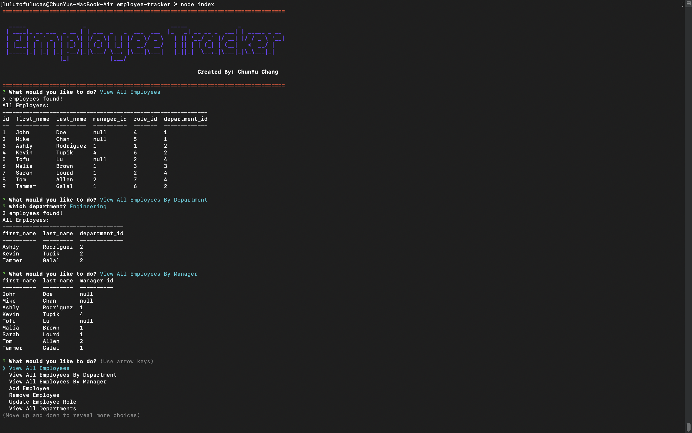

# employee-tracker

## User Story
  
```
AS A business owner
I WANT to be able to view and manage the departments, roles, and employees in my company
SO THAT I can organize and plan my business

```

## Description
  This application is for a business owner to be able to view and manage departments, roles, and employees in their company for organizing and plan their business.
## Video 
[Click here for Video](https://mr91217.github.io/employee-tracker/)
## Screenshot

## Table of Contents
- [Description](#description)
- [Video Link](#Video)
- [Installation](#installation)
- [Usage](#usage)
- [Languages](#languages)
- [Contributing](#contributing)
- [Reference](#reference)
- [Questions](#questions)
## Installation
  `npm init -y`<br />  
  `npm install mysql2 inquirer console.table`<br />
  `source db/ds.sql`,`source db/schema.sql`,`source db/seeds.sql` in MySQL<br />
## Usage
  Run the following command at th root of your project and answer the prompted questions:<br />

  `npm start`<br />
  `node index`<br />
  
## Languages
  JavaScript, MySQL, Node
## Contributing
  ChunYu Chang
## Reference
  1.Remove Function is reference from:
  https://github.com/jpd61/employee-tracker <br />
  2.Update Function is reference from:
  https://github.com/jpd61/employee-tracker <br />
  3.Colored Title is reference from:
  https://github.com/jpd61/employee-tracker <br />
  4.Class Moudles <br />
  https://github.com/mr91217/u-develop-it <br />
## Questions
 Contact me<br />

## Contact
GitHub: [mr91217](https://github.com/mr91217)<br />
<br />
Email: mr91217@gmail.com<br />
<br />